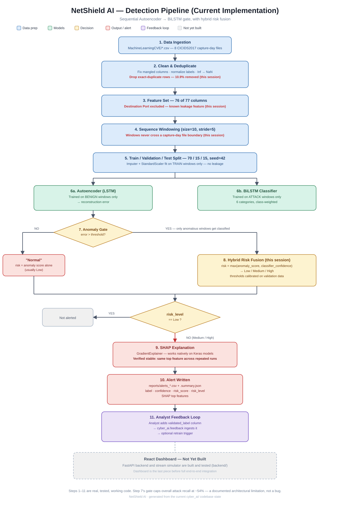
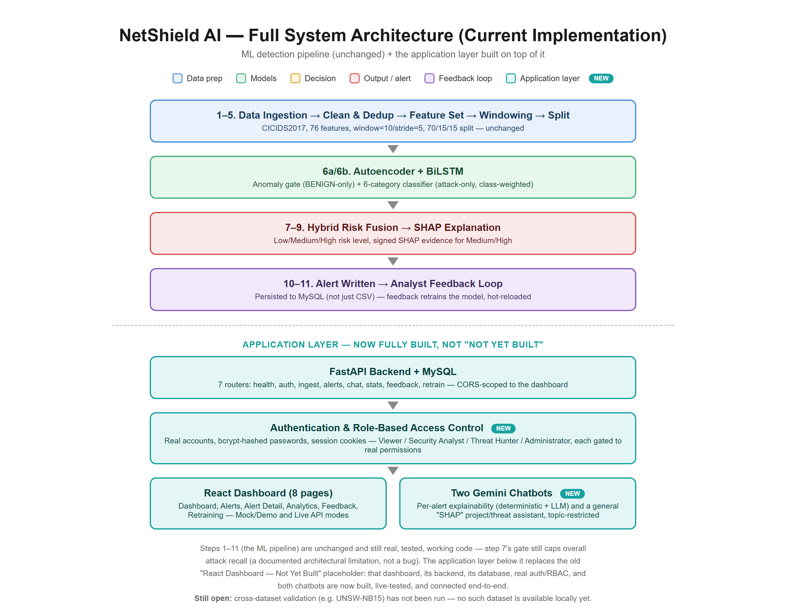

# AI-Driven Predictive Analytics for Cyber Threat Detection





The diagram above is the ML pipeline only (steps 1-11 below). [`docs/full_architecture.png`](docs/full_architecture.png)
shows the application layer built on top of it — backend, database, authentication, dashboard, and chatbots — which
the pipeline-only diagram predates.

This project implements a hybrid Autoencoder + BiLSTM threat detection pipeline over the CICIDS2017 `MachineLearningCVE` CSV files:

1. Data collection and cleaning from CICIDS2017 CSV flow logs (including duplicate-row removal).
2. Preprocessing for numeric network-flow features, with a known leakage feature excluded.
3. Temporal sequence windowing, kept within a single capture-day file per window.
4. Autoencoder-based anomaly detection trained on BENIGN traffic only.
5. BiLSTM-based threat classification trained on grouped attack traffic only (runs on Autoencoder-flagged windows).
6. Hybrid risk fusion combining the Autoencoder's anomaly score and the BiLSTM's classifier confidence into a calibrated Low/Medium/High risk level.
7. SHAP-based explainable AI (GradientExplainer) for Medium/High risk alert windows.
8. Alerting and reporting to CSV/JSON.
9. Analyst feedback ingestion for model retraining.

A FastAPI [backend](#backend) and a browser [dashboard](#frontend-dashboard) sit on top of this pipeline for live ingestion, alert review, and analyst feedback.

## Setup

```powershell
pip install -r requirements.txt
```

The dataset folder is expected here (relative to the repo root):

```text
MachineLearningCVE/
```

## Threat Categories

The BiLSTM classifier predicts the six project categories below:

| Project category | CICIDS2017 labels used |
| --- | --- |
| Brute Force | FTP-Patator, SSH-Patator, Web Attack-Brute Force |
| Malware Traffic | Heartbleed, Web Attack-XSS, Web Attack-Sql Injection |
| Botnet Activity | Bot |
| Data Exfiltration | Infiltration |
| DoS / DDoS | DDoS, DoS Hulk, DoS GoldenEye, DoS slowloris, DoS Slowhttptest |
| Port Scanning | PortScan |

Note: CICIDS2017 does not include a dedicated label named `Malware Traffic`. The project maps exploit/web-attack labels into that category so the model follows the required six-class taxonomy. A raw label that matches neither BENIGN nor any category above is excluded from BiLSTM training/evaluation rather than silently guessed at — see [Data Cleaning Details](#data-cleaning-details).

`Data Exfiltration` has very few raw samples (36) in CICIDS2017. Training keeps it in the taxonomy, but any run where a category has fewer than 200 raw samples prints a warning and records it under `low_sample_categories` in `training_metrics.json` — treat those categories' per-class metrics as indicative only, not reliable.

## Train

The default config uses a balanced cap of `50000` windows per class (see [Data Cleaning Details](#data-cleaning-details) for how this cap is applied) so training is practical on a CPU machine.

```powershell
python -m cyber_ai.train --config configs/default.yaml
```

For a quick smoke test:

```powershell
python -m cyber_ai.train --max-rows-per-class 100 --epochs 1 --batch-size 32 --window-size 5 --stride 2
```

For full-dataset training:

```powershell
python -m cyber_ai.train --use-full-dataset
```

Optional: cut the feature set down to the top-K most important columns (ranked by a Random Forest fit on training windows only), instead of using all 76:

```powershell
python -m cyber_ai.train --top-k-features 25
```

This is implemented and tested, but **not enabled by default** — on this dataset it improved the Autoencoder (balanced accuracy 66.7% → 69.7%) but severely hurt the BiLSTM classifier (accuracy 99.3% → 91.0%, several classes' precision collapsed), because a single feature ranking optimized for BENIGN-vs-attack doesn't preserve what's needed to tell the six attack categories apart. Left available for experimentation, not adopted as the default pipeline.

Training writes:

```text
artifacts/preprocessing.joblib
artifacts/models/autoencoder.keras
artifacts/models/bilstm_classifier.keras
reports/training_metrics.json
```

`training_metrics.json` includes, per run: dataset/window counts, unmapped-label counts, low-sample-category warnings, (if `--top-k-features` was used) the full feature importance ranking, Autoencoder and BiLSTM classification reports, and a `hybrid_risk` section with the fused system's precision/recall/F1/false-positive-rate/false-negative-rate on the held-out test set.

## Predict And Alert

```powershell
python -m cyber_ai.predict --input-csv MachineLearningCVE\Friday-WorkingHours-Afternoon-DDos.pcap_ISCX.csv
```

This writes an alert CSV and summary JSON under `reports/`. The inference pipeline:

```text
New traffic -> Autoencoder -> below threshold -> "Normal" (risk = anomaly score alone)
                            -> above threshold -> BiLSTM -> Hybrid Risk Fusion -> Low / Medium / High
                                                                                -> Medium/High -> SHAP -> alert
```

Hybrid risk fusion (`cyber_ai/hybrid_risk.py`) combines the Autoencoder's normalized anomaly score and the BiLSTM's classifier confidence — `risk = max(anomaly_score, classifier_confidence)` when the window was classified, or just the anomaly score otherwise — then maps that onto Low/Medium/High using thresholds calibrated from the validation set's own score distribution (not hardcoded). By default, only Medium/High windows are written to the alert CSV; pass `--include-all-windows` to keep everything.

Each alert row includes `confidence` (BiLSTM's class probability, if classified), `anomaly_score` (raw Autoencoder reconstruction error), `risk_score` (the fused 0–1 value), and `risk_level` (Low/Medium/High).

To include SHAP explanations for the first alert windows:

```powershell
python -m cyber_ai.predict --input-csv MachineLearningCVE\Friday-WorkingHours-Afternoon-DDos.pcap_ISCX.csv --shap
```

SHAP uses `shap.GradientExplainer` (native to the Keras models, not the flattened-window black-box Kernel SHAP approach) for both the classifier and the Autoencoder, then aggregates attribution back to original CICIDS feature names. For the Autoencoder, the explained target is the same scalar reconstruction-error signal the anomaly threshold actually acts on (via a small wrapper model in `cyber_ai/explain.py`), not the raw reconstruction.

## Latency Benchmark

Measures real per-window detection latency (not batched — one window at a time, matching how a live stream would actually be scored) across three stages, using the trained artifacts:

```powershell
python -m cyber_ai.latency_benchmark --input-csv MachineLearningCVE\Friday-WorkingHours-Afternoon-DDos.pcap_ISCX.csv --num-windows 500
```

Writes `reports/latency_benchmark.json` with mean/p50/p95/max latency (ms) for: Autoencoder-only (every window), Autoencoder+BiLSTM (only anomaly-flagged windows), SHAP-only (only Medium/High windows), and the realistic blended full-pipeline latency across the actual mix of Normal/Medium/High windows a live stream would see.

## Panel Demo Traffic

`demo/panel_demo_traffic.csv` is a small (185-row), deliberately-paced sequence of **real** CICIDS2017 rows — never synthetic — for demonstrating the pipeline live without waiting on a random timer to surface something interesting: calm BENIGN, a DDoS burst, back to BENIGN, a Port Scanning burst, back to BENIGN, a Botnet Activity burst, closing BENIGN. Regenerate it with `python scripts/build_demo_csv.py` (see that file's docstring for how candidate slices are picked and scored against the real trained model rather than assumed).

Run it through the real pipeline:

```powershell
python -m cyber_ai.predict --input-csv demo\panel_demo_traffic.csv --include-all-windows --shap --shap-max-alerts 30
```

On the current trained model this demo file honestly shows both a strength and a known limitation worth narrating live: the DDoS and Botnet Activity bursts are caught with ~99%/~75% confidence respectively, while the Port Scanning burst is only partially caught (2 of 6 windows) — a real, visible instance of the sequential-gate recall ceiling described in [Known Limitations](#known-limitations), not a demo failure. Point it out proactively rather than hoping it doesn't come up.

## Dynamic Feedback Loop

1. Open the alert CSV.
2. Add a `validated_label` column.
3. Fill it with analyst-approved labels for rows that should be used for retraining.
4. Ingest feedback:

```powershell
python -m cyber_ai.feedback --alerts-csv reports\alerts_YYYYMMDD_HHMMSS.csv
```

To retrain immediately using the feedback store:

```powershell
python -m cyber_ai.feedback --alerts-csv reports\alerts_YYYYMMDD_HHMMSS.csv --retrain
```

## Report Assets

Regenerate the confusion matrix, ROC curves, reconstruction error distribution, and per-class metrics table as image/CSV files (used for the project report and panel slides) from the currently trained artifacts:

```powershell
python -m cyber_ai.report_assets
```

Writes `reports/figures/confusion_matrix.png`, `reports/figures/roc_curves.png`, `reports/figures/reconstruction_error_distribution.png`, `reports/figures/per_class_metrics.csv`, and `reports/figures/summary.json`, all rebuilt from the exact held-out test split the current `artifacts/preprocessing.joblib` and models were trained/evaluated on. If `data/feedback/validated_traffic.csv` has grown since training with labels the trained encoder doesn't recognize (e.g. an analyst-entered category name rather than a raw CICIDS label), those rows are skipped with a printed warning rather than failing the run.

## Backend

`backend/` is a FastAPI service that wraps this pipeline for live use: upload/replay traffic CSVs, persist scored alerts to MySQL, expose them (plus stats, feedback, and retraining) over a REST API, and hot-reload the model in place after a retrain — no server restart needed. It also enforces real authentication and role-based access control (four roles: Viewer, Security Analyst, Threat Hunter, Administrator — see [backend/README.md](backend/README.md#authentication) for the seeded demo accounts) and hosts two Gemini-backed chatbots (a per-alert explainability assistant and a general project/threat-education assistant). See [backend/README.md](backend/README.md) for setup (MySQL config, `.env`, `uvicorn app.main:app`) and the full API surface (`/api/health`, `/api/auth/*`, `/api/ingest/*`, `/api/alerts`, `/api/alerts/{id}/chat`, `/api/chat`, `/api/stats/*`, `/api/feedback`, `/api/retrain`).

## Frontend Dashboard

Two dashboards exist:

- **`frontend/dashboard-app/`** (current) — a React + TypeScript SPA (Vite) with 8 pages (Dashboard, Alerts, Alert Detail, Analytics, a "SHAP" project/threat chatbot, Feedback, Retraining), real login backed by the backend's authentication, and a Mock/Demo data mode (cosmetic, no backend needed) alongside Live API mode. See `frontend/dashboard-app/README.md`.
- **`frontend/netshield-dashboard.html`** (earlier prototype, kept for reference) — a single self-contained HTML/JS file, no build step, no real authentication. Still functional; superseded by the React app above for active development.

## Data Cleaning Details

- CICIDS2017 headers are cleaned automatically, including leading spaces and duplicated feature names.
- Infinite flow-rate values are treated as missing and median-imputed from training windows.
- **Exact-duplicate rows are dropped** before windowing (~11% of the raw dataset) — CICIDS2017 is documented to contain a large number of exact-duplicate flow records; left in, identical rows can land in both train and test splits, letting the model partly recognize memorized rows instead of generalizing.
- **`Destination Port` is excluded from the model's feature set** — a well-documented CICIDS2017 leakage feature, since this synthetic testbed's attacks target fixed ports.
- Sequence windows are built **per source file**, never spanning two different capture-day CSVs, and any row-count cap (`max_rows_per_class`/`max_rows`) is applied by sampling whole windows, not raw rows — sampling rows first would leave gaps in the timeline that a later "10-row window" would silently splice across.
- A raw label that doesn't match BENIGN or any of the six attack categories (e.g. a garbled encoding, or a free-text analyst feedback label) is excluded from BiLSTM training/evaluation and counted under `unmapped_labels` in the metrics — never silently guessed into a category.
- The Autoencoder threshold is calibrated from benign validation-window reconstruction errors (`balanced_accuracy` strategy by default — see `cyber_ai/calibrate.py` to recalibrate independently of a full retrain).
- The BiLSTM classifier uses class weights to reduce category-imbalance bias.

## Known Limitations

- **Sequential architecture caps overall detection recall.** BiLSTM only classifies windows the Autoencoder already flagged as anomalous; the Autoencoder currently misses a meaningful share of real attacks at that gate (see `hybrid_risk.classification_report` in `training_metrics.json` for the current recall), so those attacks never reach classification, explanation, or alerting. This is a known, documented tradeoff of the sequential-gate design (vs. a parallel design where both models see every window), not a bug.
- **`Data Exfiltration`** has too few raw samples (36) in CICIDS2017 for its per-class metrics to be statistically meaningful — see the `low_sample_categories` warning above.
- The current results are validated on CICIDS2017 only; no cross-dataset generalization check (e.g. against UNSW-NB15) has been run yet.
